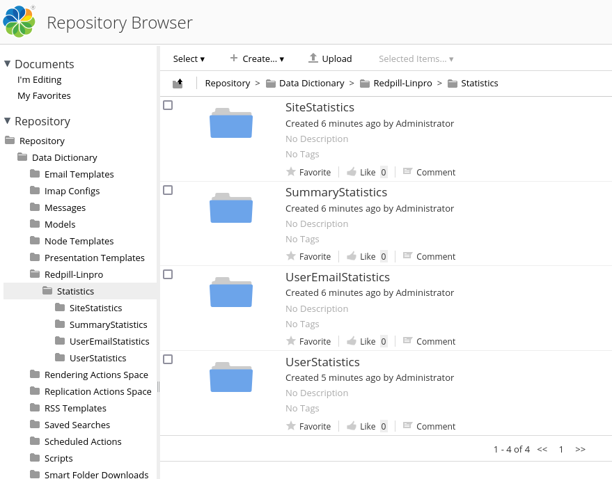

# Alfresco System Usage Statistics

This module is sponsored by Redpill Linpro AB|ApS - http://www.redpill-linpro.com.

## Description

This project contains some basic statistics gathering of your Alfresco system
Structure.



## Structure

The project consists of a repository module and a share module packaged as jar files.

## Building & Installation

Go to the `Alfresco AIO Project - SDK 4.4` sektion of this page to get all options.

Just to build the project

````
mvn clean package
````

To build the pjoject and deployed via Podman use

````
./run.sh build_start
````

Old version of the jar files are downloadable from: https://maven.redpill-linpro.com/nexus/index.html#nexus-search;quick~alfresco-system-usage-statistics

## Platform

Project structure for the `Platform` part of this project.
````
├── pom.xml
└── src
    └── main
        ├── assembly
        │   ├── amp.xml
        │   ├── file-mapping.properties
        │   └── web
        │       └── README.md
        ├── java
        │   └── org
        │       └── redpill
        │           └── alfresco
        │               └── repo
        │                   └── statistics
        │                       ├── jobs
        │                       │   ├── ClusteredExecuter.java
        │                       │   ├── GenerateSiteStatistics.java
        │                       │   ├── GenerateSummaryStatistics.java
        │                       │   ├── GenerateUserEmailStatistics.java
        │                       │   └── GenerateUserStatistics.java
        │                       ├── scripts
        │                       │   ├── ActiveUsersReport.java
        │                       │   ├── ScriptSiteReport.java
        │                       │   └── SitesReport.java
        │                       └── service
        │                           ├── ActiveUsers.java
        │                           ├── ReportSiteUsage.java
        │                           ├── SummaryReport.java
        │                           └── UserLoginDetails.java
        └── resources
            └── alfresco
                └── module
                    └── alfresco-system-usage-statistics-platform
                        ├── alfresco-global.properties
                        ├── audit
                        │   └── custom-audit-extractors.xml
                        ├── context
                        │   ├── bean-context.xml
                        │   └── scheduled-context.xml
                        ├── module-context.xml
                        └── module.properties

````

## Share

Project structure for the `Share` part of this project.
````
├── pom.xml
└── src
    └── main
        └── resources
            ├── alfresco
            │   ├── messages
            │   │   ├── rl-statistics.properties
            │   │   └── rl-statistics_sv.properties
            │   ├── site-webscripts
            │   │   └── org
            │   │       └── redpill
            │   │           └── alfresco
            │   │               └── console
            │   │                   └── statistics
            │   │                       ├── site-statistics-console.get_da.properties
            │   │                       ├── site-statistics-console.get.desc.xml
            │   │                       ├── site-statistics-console.get.html.ftl
            │   │                       ├── site-statistics-console.get.js
            │   │                       ├── site-statistics-console.get.properties
            │   │                       ├── site-statistics-console.get_sv.properties
            │   │                       ├── summary-statistics-console.get_da.properties
            │   │                       ├── summary-statistics-console.get.desc.xml
            │   │                       ├── summary-statistics-console.get.html.ftl
            │   │                       ├── summary-statistics-console.get.js
            │   │                       ├── summary-statistics-console.get.properties
            │   │                       ├── summary-statistics-console.get_sv.properties
            │   │                       ├── user-email-statistics-console.get_da.properties
            │   │                       ├── user-email-statistics-console.get.desc.xml
            │   │                       ├── user-email-statistics-console.get.html.ftl
            │   │                       ├── user-email-statistics-console.get.js
            │   │                       ├── user-email-statistics-console.get.properties
            │   │                       ├── user-email-statistics-console.get_sv.properties
            │   │                       ├── user-statistics-console.get_da.properties
            │   │                       ├── user-statistics-console.get.desc.xml
            │   │                       ├── user-statistics-console.get.html.ftl
            │   │                       ├── user-statistics-console.get.js
            │   │                       ├── user-statistics-console.get.properties
            │   │                       └── user-statistics-console.get_sv.properties
            │   └── web-extension
            │       └── rl-statistics-context.xml
            └── META-INF
                └── rl
                    └── components
                        └── console
                            ├── site-statistics-console.css
                            ├── site-statistics-console.js
                            ├── summary-statistics-console.css
                            ├── summary-statistics-console.js
                            ├── user-email-statistics-console.css
                            ├── user-email-statistics-console.js
                            ├── user-statistics-console.css
                            └── user-statistics-console.js
````

## License


This application is licensed under the LGPLv3 License. See the [LICENSE file](LICENSE) for details.

## Authors

Marcus Svartmark - Redpill Linpro AB

## Alfresco AIO Project - SDK 4.4

This is an All-In-One (AIO) project for Alfresco SDK 4.4.

Run with `./run.sh build_start` or `./run.bat build_start` and verify that it

 * Runs Alfresco Content Service (ACS)
 * Runs Alfresco Share
 * Runs Alfresco Search Service (ASS)
 * Runs PostgreSQL database
 * Deploys the JAR assembled modules

All the services of the project are now run as docker containers. The run script offers the next tasks:

 * `build_start`. Build the whole project, recreate the ACS and Share docker images, start the dockerised environment composed by ACS, Share, ASS and PostgreSQL and tail the logs of all the containers.
 * `build_start_it_supported`. Build the whole project including dependencies required for IT execution, recreate the ACS and Share docker images, start the dockerised environment composed by ACS, Share, ASS and PostgreSQL and tail the logs of all the containers.
 * `start`. Start the dockerised environment without building the project and tail the logs of all the containers.
 * `stop`. Stop the dockerised environment.
 * `purge`. Stop the dockerised container and delete all the persistent data (docker volumes).
 * `tail`. Tail the logs of all the containers.
 * `reload_share`. Build the Share module, recreate the Share docker image and restart the Share container.
 * `reload_acs`. Build the ACS module, recreate the ACS docker image and restart the ACS container.
 * `build_test`. Build the whole project, recreate the ACS and Share docker images, start the dockerised environment, execute the integration tests from the `integration-tests` module and stop the environment.
 * `test`. Execute the integration tests (the environment must be already started).

### Few things to notice

 * No parent pom
 * No WAR projects, the jars are included in the custom docker images
 * No runner project - the Alfresco environment is now managed through [Docker](https://www.docker.com/)
 * Standard JAR packaging and layout
 * Works seamlessly with Eclipse and IntelliJ IDEA
 * JRebel for hot reloading, JRebel maven plugin for generating rebel.xml [JRebel integration documentation]
 * AMP as an assembly
 * Persistent test data through restart thanks to the use of Docker volumes for ACS, ASS and database data
 * Integration tests module to execute tests against the final environment (dockerised)
 * Resources loaded from META-INF
 * Web Fragment (this includes a sample servlet configured via web fragment)

### TODO

  * Abstract assembly into a dependency so we don't have to ship the assembly in the archetype
  * Functional/remote unit tests
